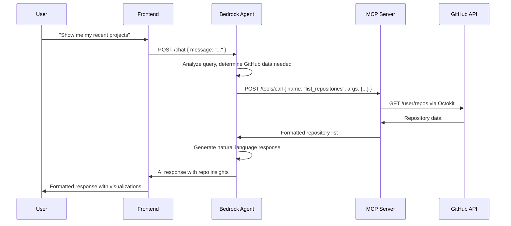
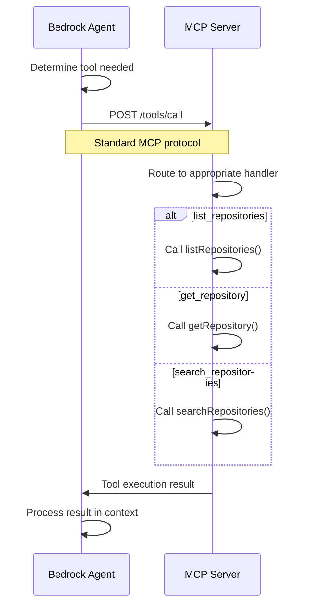

# AI Portfolio - Bedrock Inline Agent + MCP Architecture

## Overview

This architecture integrates **Amazon Bedrock Inline Agents** with a **Model Context Protocol (MCP) server** to create an AI-powered GitHub portfolio assistant.

## Architecture Diagram

```
┌─────────────────┐    ┌─────────────────┐    ┌─────────────────┐    ┌─────────────────┐
│                 │    │                 │    │                 │    │                 │
│   Frontend      │───▶│  Bedrock        │───▶│   MCP Server    │───▶│   GitHub API    │
│   (React/Web)   │    │  Inline Agent   │    │   (Express)     │    │   (REST)        │
│                 │    │                 │    │                 │    │                 │
└─────────────────┘    └─────────────────┘    └─────────────────┘    └─────────────────┘
        │                        │                        │                        │
        │                        │                        │                        │
   HTTP Requests            AWS SDK v3              HTTP + MCP Protocol        Octokit
   POST /chat              InvokeInlineAgent         POST /tools/call         REST API
   GET /health             with Action Groups        GET /tools               Authentication
```

## Component Details

### 1. Frontend Application (React/Next.js)
- **Location**: `client/`
- **Purpose**: User interface for interacting with the AI assistant
- **Key Features**:
  - Chat interface for natural language queries
  - Repository visualization
  - Project showcase
  - Real-time responses

### 2. Bedrock Inline Agent Server
- **Location**: `server/src/inlineAgentServer.ts`
- **Purpose**: Orchestrates AI conversations with GitHub data access
- **Key Features**:
  - Bedrock Inline Agent integration
  - Session management
  - Error handling and logging
  - Health checks

### 3. MCP Server (Model Context Protocol)
- **Location**: `mcp-github/src/index.ts`
- **Purpose**: Standardized interface for GitHub API access
- **Key Features**:
  - GitHub API wrapper using Octokit
  - MCP-compliant tool definitions
  - Repository data enrichment
  - Rate limiting and error handling

### 4. GitHub API Integration
- **Technology**: Octokit REST client
- **Purpose**: Access to GitHub repositories and metadata
- **Capabilities**:
  - Repository listing and search
  - README content extraction
  - Language analysis
  - Stars, forks, and activity metrics

## Data Flow

### 1. User Query Processing


### 2. Tool Invocation Flow


## Configuration

### Environment Variables

**Bedrock Agent Server** (`.env`):
```bash
# AWS Configuration
AWS_REGION=us-east-1
AWS_ACCESS_KEY_ID=your_access_key
AWS_SECRET_ACCESS_KEY=your_secret_key
BEDROCK_AGENT_ROLE_ARN=arn:aws:iam::account:role/bedrock-agent-role

# MCP Server Connection
MCP_SERVER_URL=http://localhost:8081

# Server Configuration
PORT=3000
NODE_ENV=development
```

**MCP Server** (`.env`):
```bash
# GitHub Configuration
GITHUB_TOKEN=your_github_personal_access_token
GITHUB_OWNER=your_github_username

# Server Configuration
PORT=8081
```

## API Specifications

### Bedrock Agent Server

#### POST /chat
Processes natural language queries and returns AI-generated responses.

**Request**:
```json
{
  "message": "What are my most popular GitHub repositories?",
  "sessionId": "optional-session-id"
}
```

**Response**:
```json
{
  "success": true,
  "response": "Based on your GitHub repositories, here are your most popular projects...",
  "timestamp": "2025-08-12T10:30:00Z"
}
```

#### GET /health
Returns system health and configuration status.

**Response**:
```json
{
  "status": "ok",
  "service": "ai-portfolio-server",
  "environment": {
    "bedrockRegion": "us-east-1",
    "mcpConnected": true,
    "hasBedrockRole": true
  }
}
```

### MCP Server

#### POST /tools/call
Executes MCP tools following the standard protocol.

**Request**:
```json
{
  "name": "list_repositories",
  "arguments": {
    "type": "owner",
    "sort": "updated",
    "limit": 10
  }
}
```

**Response**:
```json
{
  "success": true,
  "result": [
    {
      "name": "ai-portfolio",
      "description": "AI-powered portfolio with GitHub integration",
      "html_url": "https://github.com/user/ai-portfolio",
      "language": "TypeScript",
      "stargazers_count": 25,
      "forks_count": 5
    }
  ]
}
```

## Available MCP Tools

### 1. list_repositories
Lists user repositories with filtering and sorting options.

**Parameters**:
- `type`: 'all' | 'owner' | 'member' (default: 'owner')
- `sort`: 'created' | 'updated' | 'pushed' | 'full_name' (default: 'updated')
- `limit`: number (default: 30, max: 100)

### 2. get_repository
Gets detailed information about a specific repository.

**Parameters**:
- `name`: string (required) - Repository name

**Returns**: Repository details + README content + language breakdown

### 3. search_repositories
Searches repositories using a query string.

**Parameters**:
- `query`: string (required) - Search query
- `limit`: number (default: 10, max: 100)

## Benefits of This Architecture

### 1. **Separation of Concerns**
- **Frontend**: Handles UI/UX and user interactions
- **Bedrock Agent**: Manages AI reasoning and conversation flow
- **MCP Server**: Specializes in GitHub data access and formatting
- **GitHub API**: Provides raw repository data

### 2. **Scalability**
- Each component can be scaled independently
- MCP server can serve multiple Bedrock agents
- Stateless design enables horizontal scaling

### 3. **Flexibility**
- Easy to add new GitHub tools to MCP server
- Bedrock agent automatically discovers new capabilities
- Frontend can connect to multiple AI services

### 4. **Maintainability**
- Clear separation of responsibilities
- Standardized MCP protocol for tool integration
- Type-safe TypeScript throughout

### 5. **Extensibility**
- MCP server can be extended with more data sources
- Additional AI models can be integrated
- New frontend interfaces can be added

## Deployment Strategy

### Development
```bash
# Terminal 1: Start MCP Server
cd mcp-github
npm run dev

# Terminal 2: Start Bedrock Agent Server
cd server
npm run dev:inline-agent

# Terminal 3: Start Frontend
cd client
npm run dev
```

### Production
- **MCP Server**: Deploy to AWS ECS/Fargate or EC2
- **Bedrock Agent Server**: Deploy to AWS Lambda or ECS
- **Frontend**: Deploy to AWS CloudFront + S3 or Vercel
- **Networking**: Use AWS ALB for load balancing and SSL termination

## Security Considerations

1. **GitHub Token**: Use minimal permissions, store securely
2. **AWS IAM**: Least privilege for Bedrock agent role
3. **Network**: Use VPC and security groups in production
4. **Secrets**: Use AWS Secrets Manager for sensitive data
5. **CORS**: Configure appropriately for frontend domains

## Monitoring and Observability

1. **Logging**: Structured logging with correlation IDs
2. **Metrics**: CloudWatch metrics for performance tracking
3. **Tracing**: AWS X-Ray for distributed tracing
4. **Health Checks**: Automated health monitoring
5. **Alerts**: CloudWatch alarms for error rates and latency

This architecture provides a robust, scalable foundation for an AI-powered GitHub portfolio assistant with clear separation of concerns and enterprise-grade capabilities.
